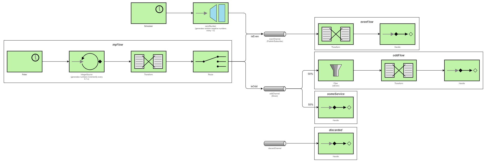

# Lab 5 Integration and SOA - Project Report

## 1. EIP Diagram (Before)



The starter code implements the following message flows and Enterprise Integration Patterns (EIPs):

1. **Message Source (Polling Consumer Pattern)**  
   A polling producer (`integerSource`) emits sequential integers starting at `0`, increasing by `1` every `100ms`.  
   These numbers are immediately routed into either `evenChannel` or `oddChannel` based on their parity.  
   A scheduled method also emits **random negative numbers** every second using a **Messaging Gateway**, but incorrectly sends them straight to `evenChannel`.

2. **Routing and Processing**
   - **Even numbers** are sent to a **Publish-Subscribe Channel**, even though there is only a single subscriber. They are then transformed (`"Number n"`) and handled by an even handler.
   - **Odd numbers** go to a **Direct Channel** that load-balances between:
     - an odd handler flow **containing a filter**, and  
     - a service activator defined in `SomeService`.
     Because the channel is direct, each odd number is sent to *one* of these consumers—but not both.

3. **Discard Flow**
   A `discardChannel` and associated flow exist but are unused. The odd filter is configured to *reject odd numbers* but the `discardChannel` is commented out, so rejected messages vanish.

**Note:** Transformers present in the diagram but not deeply explained here mainly perform logging and type conversion (Int → String `"Number n"`).

---

## 2. Analysis of Issues

The behaviour produced by the starter code does *not* match what is required in the lab assignment. Below are the issues, the EIP patterns involved, and why the system behaved incorrectly.

---

### **Bug 1 — Source Sends Directly to evenChannel/oddChannel**  

**Pattern involved:** *Message Source → Router*  

**Problem:**  
The `myFlow` routes directly to `evenChannel` or `oddChannel`, preventing the gateway-injected numbers from passing through the same router.  
This violates the intended **single point of routing** pattern.  

**Consequence:**  
Only polled numbers are routed; gateway numbers bypass the router completely.

```kotlin
  @Bean
  fun myFlow(integerSource: AtomicInteger): IntegrationFlow =
      integrationFlow(
          source = { integerSource.getAndIncrement() },
          options = { poller(Pollers.fixedRate(100)) },
      ) {
          ...
          route { p: Int ->
              val channel = if (p % 2 == 0) "evenChannel" else "oddChannel"
              logger.info("🔀 Router: {} → {}", p, channel)
              channel
          }
      }
```

---

### **Bug 2 — Gateway Sends Directly to evenChannel**  

**Pattern involved:** *Messaging Gateway → Unified Ingress Channel*  

**Problem:**  
All injected negative numbers — both even and odd — are forced into `evenChannel`.

**Consequence:**  
Odd negative numbers incorrectly enter the even flow, contradicting the Routing responsibility.

```kotlin
  @MessagingGateway
  interface SendNumber {
      @Gateway(requestChannel = "evenChannel")
      fun sendNumber(number: Int)
  }
```

---

### **Bug 3 — oddChannel Is a Direct Channel**  

**Pattern involved:** *Publish–Subscribe Channel vs Direct Channel*  

**Problem:**  
A direct channel delivers a message to only one subscriber.

**Consequence:**  
Odd numbers are sent either to the service activator or the odd handler—but never both.
This is inconsistent with the expected behaviour in the target diagram, where both listeners must receive the odd numbers.

---

### **Bug 4 — Odd Flow Filters Out Odd Numbers**  

**Pattern involved:** *Filter Pattern*

**Problem:**  
The filter passes even numbers in an **odd** flow.
This inverts the purpose of the flow and contradicts the router, which already ensures only odd numbers should reach it.

**Consequence:**  
Odd numbers are silently discarded; even numbers (if they somehow arrive) would pass.

```kotlin
  @Bean
  fun oddFlow(): IntegrationFlow =
      integrationFlow("oddChannel") {
          filter { p: Int ->
              val passes = p % 2 == 0
              logger.info("  🔍 Odd Filter: checking {} → {}", p, if (passes) "PASS" else "REJECT")
              passes
          } // , { discardChannel("discardChannel") }
          ...
      }
```

---

### **Bug 5 — Unused discardChannel and discardFlow**  

**Pattern involved:** *Discard Channel Pattern*

**Problem:**  
A discard channel is defined but never referenced (filter’s `discardChannel` option is commented out in the code above).

**Consequence:**  
Discarded messages vanish without observation or handling, breaking traceability.

---

### **Observed Effects**

**1.Inconsistent handling of odd numbers**
- Odd numbers reaching the odd handler are filtered out and lost.
- Odd numbers routed to the service activator are handled normally. This inconsistent behaviour is caused by Bugs 3 and 4 together.

**2. Negative odd numbers treated as even numbers**
- Because of Bug 2, gateway numbers bypass routing and go straight to `evenChannel`.
- Therefore even negative numbers and odd negative numbers are processed identically.

---

## 3. Implementation Changes

### **Fix for Bug 1 — Introduce numberChannel as a unified ingress channel**  

**Before:**   
Source routed directly to even/odd channels.

**After:**  
Source sends to numberChannel, and a separate flow performs the routing:

```kotlin  
  @Bean
  fun sourceFlow(integerSource: AtomicInteger): IntegrationFlow =
        integrationFlow(
            source = { integerSource.getAndIncrement() },
            options = { poller(Pollers.fixedRate(100)) },
        ) {
            ... 
            channel("numberChannel")
        }
 
  @Bean
  fun numberFlow(integerSource: AtomicInteger): IntegrationFlow =
      integrationFlow("numberChannel") {
          route { p: Int ->
              val channel = if (p % 2 == 0) "evenChannel" else "oddChannel"
              logger.info("🔀 Router: {} → {}", p, channel)
          }
      }
```

**Why:**  
This enforces the **Router** as the single point of decision-making for all numbers, regardless of origin.

---

### **Fix for Bug 2 — Gateway now sends to numberChannel**  

**Before:**   
Gateway injected messages directly to evenChannel.

**After:**  
```kotlin
  @MessagingGateway
  interface SendNumber {
      @Gateway(requestChannel = "numberChannel")
      fun sendNumber(number: Int)
  }
```

**Why:**  
Ensures gateway messages enter the system at the same ingress point as polled numbers → correct **Message Ingress Pattern**.

---

### **Fix for Bug 3 — Change oddChannel to Publish/Subscribe**  

**Before:**   
Odd channel was a Direct Channel.

**After:**  
```kotlin
  @Bean
  fun oddChannel(): PublishSubscribeChannelSpec<*> = MessageChannels.publishSubscribe()
```

**Why:**    
Both odd handlers must receive the same message. This correctly applies the **Publish–Subscribe Channel Pattern**.

---

### **Fix for Bug 4 — Remove the odd filter**  

**Before:**   
A filter rejected all odd numbers.

**After:**  
Filter removed entirely.

**Why:**    
The router already guarantees only odd numbers arrive here.
Removing the filter aligns the odd flow with the **Message Translation and Processing Pattern**, instead of incorrectly using a Filter Pattern.

---

### **Fix for Bug 5 — Remove Discard Components**  

**Before:**   
discardChannel and its flow existed but were unused.

**After:**  
They were removed.

**Why:**    
No filter generates discarded messages anymore.
This avoids unused components and simplifies the diagram, following **Clean Integration Architecture** principles.

---

### **Additional Improvement — evenChannel changed to Direct**  

**Before:**   
`evenChannel` was publish/subscribe with only one subscriber.

```kotlin
  @Bean
  fun evenChannel(): PublishSubscribeChannelSpec<*> = MessageChannels.publishSubscribe()
```

**After:**  
Converted to a direct channel.

**Why:**    
A publish/subscribe channel was unnecessary overhead.
Using a **Direct Channel Pattern** reflects the simple 1:1 relationship.

---

### **Primary Task Final Notes** 
The corrected implementation now matches the target EIP behaviour:
- A **single ingress channel** (`numberChannel`)
- A **Router** that consistently dispatches messages
- Proper use of **Publish–Subscribe** for odd processing
- Removal of unintended filtering
- No unused discard functionality

The resulting message flow is consistent, deterministic, and aligned with the intended EIP design.

### **Extra 1 — Content Enricher** 

**Description:**  
A Content Enricher adds extra metadata or context to messages as they flow through the system. This demonstrates the **Content Enricher EIP**, which is used to enrich messages with headers or external data before further processing.

**Implementation:**  
A header enricher was added to `numberFlow`. It injects a new header `"parity"` (`"even"`/`"odd"`).
A custom `ParityHeaderProcessor`  (`HeaderValueMessageProcessor`) was implemented to compute this value.

```kotlin
  class ParityHeaderProcessor : HeaderValueMessageProcessor<String> {
      override fun processMessage(message: Message<*>): String {
          val n = message.payload as Int
          return if (n % 2 == 0) "even" else "odd"
      }
  }

  @Bean
  fun numberFlow(integerSource: AtomicInteger): IntegrationFlow =
      integrationFlow("numberChannel") {
          enrichHeaders {
              header("parity", ParityHeaderProcessor())
          }
          ...
      }
```

**Benefit:**    
Messages can carry contextual metadata, enabling message enhancement patterns.

---

### **Extra 2 — Message History** 

**Description:**  
Message History tracks which components a message has passed through. This uses the **Message History EIP**, enabling end-to-end traceability.

**Implementation:**  
Message History was enabled in `application.yml`

```.yml
spring:
  integration:
    message:
      history:
        enabled: true
```

and `@EnableMessageHistory` was added to the application.
A function extracts the `"history"` header and logs all visited components in order.

```kotlin
private fun logHistory(msg: Message<*>) {
        val history = msg.headers["history"] as List<*>
        var lastComponent = ""

        logger.info("  📜 History: {")
        history.forEach {
            val component =
                it
                    .toString()
                    .substringBefore("#")
                    .substringBefore(".")
                    .substringAfter("name=")
                    .substringBefore(",")
            if (component != lastComponent) {
                logger.info("        Visited: {}", component)
                lastComponent = component
            }
        }
        logger.info("  }")
    }
```

**Benefit:**  
Enables full auditability of message traversal across the integration system. 

### **Extra 3 — Wire Tap** 

**Description:**  
The Wire Tap pattern enables observing messages without modifying or delaying the main flow execution. It is used for monitoring, debugging, and auditing.

**Implementation:**  
A `wireTap("tapChannel")` was inserted into all major flows.
A dedicated `tapFlow` receives tapped messages and logs their message history through the `logHistory` function. Additionally, each flow enriches messages with a custom `"where"` header, allowing the tap flow to clearly identify **which flow the message was in when it was tapped**, improving traceability and contextual logging.

**Benefit:**    
Provides transparent message inspection and observability without impacting message delivery. Demonstrates correct application of the **Wire Tap EIP** for non-intrusive monitoring. Combined with message history and content enrichment, provides a powerful debugging and monitoring framework.

### **Extra 4 — Dead Letter Channel (DLC)** 

**Description:**  
A Dead Letter Channel is a dedicated endpoint for handling messages that cannot be processed successfully, even after retry attempts. This reflects the **Dead Letter Channel EIP**, supporting fault tolerance and error isolation.

**Implementation:**   
A simulated error was introduced in the `oddFlow`, where the handler intentionally fails a random number of times to trigger retry behaviour.  

A `RequestHandlerRetryAdvice` with a `RetryTemplate` was added to the odd handler with exponential backoff and max retry attempts. When retries are exhausted, a recovery callback builds a failure-wrapped message and routes it to a dedicated deadLetterChannel.

A corresponding `dlqFlow` consumes and logs failed messages.

**Benefit:**  
The system gains robust, enterprise-grade error handling and resilience. Failed messages are never lost — they are captured, logged, and preserved for inspection, following best practices for reliable message-driven architectures.

## 4. Learning Outcomes

Throughout this lab, I gained a much deeper understanding of **Enterprise Integration Patterns (EIPs)** and how they structure complex message-driven systems. Working through routing, transformation, publish–subscribe channels, filters, dead-letter queues, wire taps, and content enrichers helped me see how each pattern solves a specific integration problem. More importantly, I learned how these patterns fit together to form a consistent and maintainable integration architecture.

I also learned how **Spring Integration** implements these patterns declaratively. Concepts like `IntegrationFlow`, channels, message headers, advice chains, and gateway abstractions clarified how Spring hides low-level messaging mechanics while still giving full control when needed. Enabling message history, adding retry advice, and configuring the dead letter channel showed me how Spring Integration blends EIP theory with robust production-ready features.

The most challenging parts were understanding why the original system behaved incorrectly and then fixing issues that were caused by multiple patterns interacting — such as Direct vs Publish-Subscribe channels, or the filter that removed all odd numbers. Debugging these required reading the logs carefully, reconstructing the message flow, and redesigning channels and flows to match the intended behavior. Implementing retry logic with the dead letter channel and building a wire tap with message history also required careful reading of Spring Integration’s documentation to ensure correct usage.

Overall, the project gave me hands-on experience designing, debugging, and extending a real integration system using classical EIPs.

---

## 5. AI Disclosure

**Did you use AI tools?**  
**Yes.**

I used **ChatGPT** throughout the assignment to help with:
- Clarifying how specific EIP patterns (Content Enricher, Wire Tap, Dead Letter Channel, Message History, Retry Advice) are typically implemented
- Improving the clarity and structure of the project report
- Getting feedback on whether certain patterns were applied correctly and how to describe them
- Refining explanation sections to better match academic writing expectations

**What I did myself:**  
- I independently analyzed the starter code and identified the bugs in the integration flows (routing issue, incorrect channel types, wrong filter condition, unused discard channel, etc.).  
- I implemented all code changes myself: routing redesign, content enrichment, wire tapping, retry logic, dead-letter channel, message history logging, and the simulated error in `oddFlow`.  
- I designed the final integration architecture, ensured each EIP pattern was correctly applied, manually tested the system, and debugged unexpected behavior.  
- I wrote the technical content of the report, diagrams, and understanding of each pattern, and used ChatGPT only to help improve readability and completeness.

**My understanding of the code and patterns:**  
I understand how messages enter through the gateway or polling source, how the `numberChannel` acts as a unified ingress point, how routing decisions are made, and how publish–subscribe channels distribute messages. I understand how headers are enriched, how wire taps observe messages without modifying them, how retry logic works with `RequestHandlerRetryAdvice`, and how the dead letter channel captures failed messages. I also understand how message history is stored and extracted for logging. AI tools helped me phrase explanations more clearly, but the architecture, implementation, and debugging were done based on my own understanding.

---
